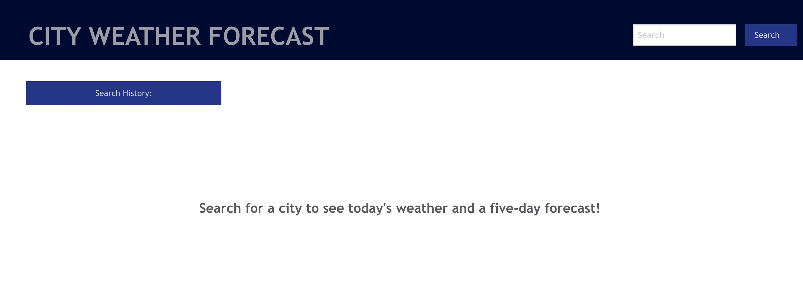
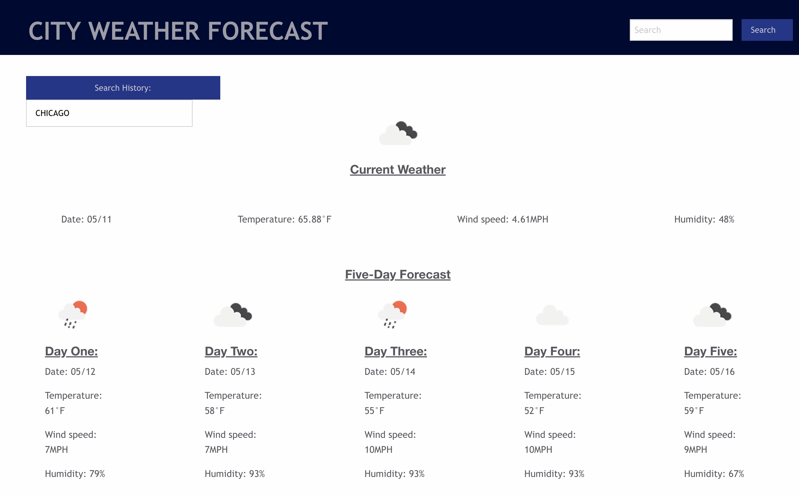

# 06-Weather

## Project Description:
<a href="https://hanwol525.github.io/06-weather/">Deployed page</a> 
This is a city weather forecast tracker. Users can input a city and receive the current weather conditions as well as a five-day forecast. Cities are added to a search history that users can use to navigate to previously-searched cities.

## Overview of Site:

## Resources/Technology Used:
<ul>
    <li> Openweather 5-day forecast API
    <li> Openweather geocoding API
    <li> Foundation (CSS Framework)
    <li> Node.js/jQuery
    <li> Day.js
    <li> Vanilla CSS, JavasScript, and HTML
</ul>

## Future updates:
<ul>
    <li> Prevent search history from logging cities repeatedly
    <li> Prevent searches for cities that don't exist
</ul>